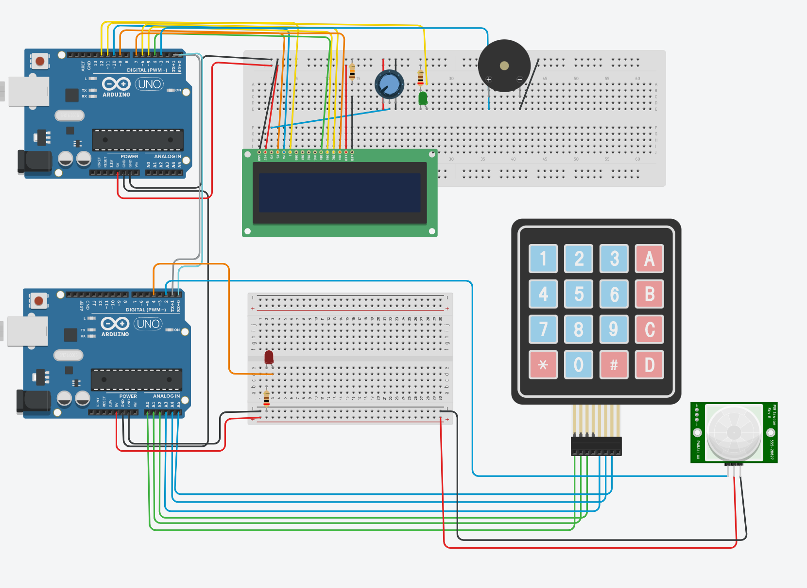

# Basics of Embedded Systems - Course project report

## Project description
The aim of the project, was create an alarm system using 2 boards: Arduino UNO and Arduino Mega. 
The project required, that either of devices is the 'slave' device and the other is the 'master' device.

The devices should be connected with either USART, I2C, or SPI communication protocols.

The basic functionality of the alarm system is as follows:
1. Device waits for movement.
2. If movement is detected, the device waits for user input:
    1. If user input is correct, the alarm is deactivated.
    2. If user input is incorrect, or no input from the user is given, the alarm is activated.
3. Once the alarm has been deactivated it will not trigger again until reset.

An important constriction, was that the use of wiring languages was not allowed (such as `digitalWrite`, `pinMode`, `Serial.println`, etc.) and i/o operations had to be done using direct port manipulation using the C language.

The use of libraries was allowed, but only libraries that were given on our course page.

Additional requirements:
- *Submit password* button on the keypad.
- *Backspace* button on the keypad.
- Use of *state machine structure* in atleast one of the devices.

## Methodolgy
My approach was to divide the responsibility of the devices as follows:

- The slave device is responsible for reading the motion sensor, reading user input from a keypad, and transmitting data to the master device.

- The master device is responsible for receiving data from the slave device, controlling and displaying the state of the alarm system, and sounding the alarm if necessary.

The communication between the devices is done using an asynchronous UART (Universal Asynchronous Receiver/Transmitter) serial communication protocol, by connecting the TX, RX and ground pins of the devices.

The communication between the devices was achieved by creating `transmit` and `receive` functions, which were used to setup the communication, and redirect stdout and stdin to the serial port, so basic `printf` and `scanf` functions could be used to send and receive data.

I did not have the Arduino Mega board, and I couldn't obtain one, so I used two Arduino UNO boards instead. This restricted my use of the keypad, to only having six buttons, instead of the usual twelve.

I used a keypad library for the slave device, and a LCD library for the master device.

*The schematic of the wiring of the devices.*

### Master device
I used a state machine structure for the master device, with the following states:
- `ARMED` - The alarm is armed and waiting for movement, LCD shows `System online`.
- `DISARMED` - The alarm is disarmed and waiting for user input, LCD displays `System disarmed`.
- `MOVEMENT_DETECTED` - The alarm has detected movement, LCD displays `Movement detected!` and waits for the slave to send a message (password or `timeout` or `no_input`), and then compares the input to the correct password, which is known by the master.
- `CORRECT_PASSWORD` - A correct password was received, LCD displays `Correct password`.
- `FAULT` - Not used.
- `ALARM` - An alarm was triggered by timeout or incorrect password, LCD displays `ALARM!` and the alarm is sounded indefinitely.

The master device handles the LCD screen with wires in ports D and B. It uses the LCD library to display some information to the user about what is happening. The user must know themselves, to enter the correct password, since the user is not prompted to do so.

The master device also flashes a led everytime it receives a message from the slave device.

In the `ALARM` state, the master device sends power to a buzzer, which sounds the alarm. First, timers are setup and a digital signal is varied using a PWM (Pulse Width Modulation) signal on pin 3 (OCR2B register) and the pulse varied in an infinite loop. The pulse width is varied between 100 and 255 with a delay of 1 millisecond between each change.

### Slave device
The slave device is responsible for reading the motion sensor, reading user input from a keypad, and transmitting data to the master device.

The slave device reads the input if the PIR sensor in a loop, and if the sensor is triggered, it sends `movement` string to the master.

After reporting movement, the slave device immediately starts listening for keypresses from the keypad. When the user submits the password, the slave device sends the input to the master device. If the user doesn't press any key for five seconds, the slave device sends `timeout` to the master device. If the password is empty, the slave device sends `no_input` to the master device.

To achieve the timeout, the keypad library was modified to take in a flag, which is set to true if no key is pressed for five seconds. The timer was set up by calculating the number of overflows of the timer, and checking if the timer has overflowed 5 times since its creation.

Since I only had the Arduino UNO, the library only worked for six buttons, which I chose to be 1, 2, 4, 5, 7, and 8. The other buttons were not connected to the board. I mapped button 7 to be a backspace, and button 8 to be a submit button.

The slave device also flashes a led everytime it sends a message to the master device.

## Improvement ideas
The program could be improved by many many ways. Many good ways are listed in the project description as optional features. I will hence only list ideas, that are not directly mentioned in the project description.
For example:
- Fixing the keypad library to work with all buttons, or using a different library, or using the MEGA board.
- Very much improve the software, with especially error handling.
- Making communication synchronized.
- Making the timeout occur independently of key presses.
- Extending to allow for multiple slave devices.
- Wireless communication.
- Cleaner wiring, code, and casing.

## Conclusion
I hope this fulfills the minimum requirements for the project, though I know some could be questioned.
The use of UART instead of USART was a mistake, since I didn't properly read the project description, and I didn't have time to change it. UART is a subset of USART, and the project description only said that USART should be used (not necessarily in synchronous mode), so I hope this is okay.

The keypad works like a keypad, but is missing some buttons. The logic could be extended to work with all buttons with a mega board, which I didn't have. An alternative might've been to extend the UNO pins with a shift register, or to atleast allow for nine buttons by modifying the keypad library.

This is a fun course and project, and hence its a shame I had too little time to dedicate to this project.

